<div align="center">

<a href="ProjectReport.pdf">
  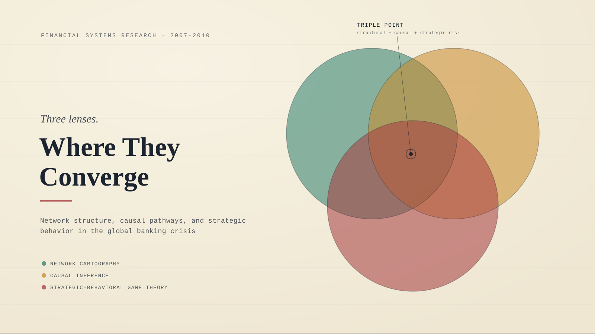
</a>

<p><em>Click the banner to view the full analysis report (PDF)</em></p>

# Visualizing Disruptive Forces in the Global Banking Network
### A Multi-Lens Analysis of the 2008 Financial Crisis

[](LICENSE)
[](https://data.bis.org/topics/CBS/data)
[](#)
[](#)

</div>

---

## 📋 Table of Contents

- [Visualizing Disruptive Forces in the Global Banking Network](#visualizing-disruptive-forces-in-the-global-banking-network)
    - [A Multi-Lens Analysis of the 2008 Financial Crisis](#a-multi-lens-analysis-of-the-2008-financial-crisis)
  - [📋 Table of Contents](#-table-of-contents)
  - [🌍 Introduction](#-introduction)
  - [📊 Data Source](#-data-source)
  - [🗂️ Repository Structure](#️-repository-structure)
  - [📈 Results \& Visualizations](#-results--visualizations)
    - [1. Network Topology — Structural Core \& Hubs](#1-network-topology--structural-core--hubs)
    - [2. Nonlinear \& Asymmetric Risk](#2-nonlinear--asymmetric-risk)
    - [3. Strategic Coordination Failure — The Bank Run](#3-strategic-coordination-failure--the-bank-run)
    - [4. Integration — The Triple-Point Overlay](#4-integration--the-triple-point-overlay)
  - [🖥️ Interactive Shiny Dashboard](#️-interactive-shiny-dashboard)
  - [🏛️ Conclusion \& Policy Recommendation](#️-conclusion--policy-recommendation)
  - [🔁 Reproducing the Analysis](#-reproducing-the-analysis)
  - [🚀 Running the Shiny App](#-running-the-shiny-app)
  - [📖 Citation](#-citation)
  - [📜 License](#-license)

---

## 🌍 Introduction

The 2008–09 global financial crisis demonstrated that modern financial architecture cannot be understood through traditional macroeconomic indicators alone. Global finance behaves as a **complex, adaptive system**, where distress in a single asset class can cascade into a catastrophic global collapse.

This project applies three distinct analytical lenses to empirical banking data to explain how localized shocks propagate through the international system:

| Lens | What it reveals |
|---|---|
| 🕸️ **Network Cartography** | Structural topology — hubs, peripheral nodes, and critical bridges |
| 🔗 **Causal Inference** | Sequential contagion vs. simultaneous common exposure; nonlinear phase transitions |
| ♟️ **Strategic-Behavioral Game Theory** | Rational, self-preserving incentives that trigger coordinated cross-border bank runs |

By overlaying all three, the project isolates the **"Triple-Point"** — the node where extreme structural connectivity, lethal causal pathways, and strategic hoarding all intersect at once.

> 💡 **Headline finding:** Just **1% of cross-border lending connections held over 34%** of global financial exposure in 2008-Q1 — and a single country, the **United Kingdom**, sat at the intersection of every disruptive force analyzed.

---

## 📊 Data Source

| | |
|---|---|
| **Source** | Bank for International Settlements (BIS), Consolidated Banking Statistics, **Table B4** |
| **Basis** | Immediate-counterparty basis, international claims, domestic banks, all instruments/maturities/currencies |
| **Nodes** | Reporting and counterparty countries |
| **Edges** | Directed, weighted — positive claims outstanding, in USD millions |
| **Timeframe** | 2007-Q1 → 2010-Q4 (quarterly) |
| **Network snapshot (2008-Q1)** | 207 countries · 1,761 directed lending ties |

---

## 🗂️ Repository Structure

```
visualizing-disruptive-forces/
├── notebooks/
│   ├── 00_data_preprocessing.ipynb
│   ├── 01_network_cartography_member_A.ipynb
│   ├── 02_causal_analysis_member_B.ipynb
│   ├── 03_strategic_behavior_member_C.ipynb
│   ├── 04_integration_and_overlay.ipynb
│   └── 05_final_evaluations_and_briefing.ipynb
├── data/
│   ├── raw/            # BIS bulk download + dashboard exports
│   └── processed/       # cleaned, positive-edge network (2007–2010)
├── figures/             # all exported chart/diagram PNGs + app screenshots (app1–3.png)
├── tables/               # exported CSV tables (e.g. table_a1_node_metrics.csv)
├── app.py                # interactive Shiny for Python dashboard
├── ProjectReport.docx / .pdf
├── banner.svg
├── CITATION.cff
├── LICENSE
└── README.md
```

---

## 📈 Results & Visualizations

### 1. Network Topology — Structural Core & Hubs

The global banking network exhibits an extreme **core-periphery architecture** centered on European financial capitals. France and the United Kingdom act as hyper-connected "super-spreaders," each maintaining direct bilateral credit lines to the majority of sovereign economies in the network.

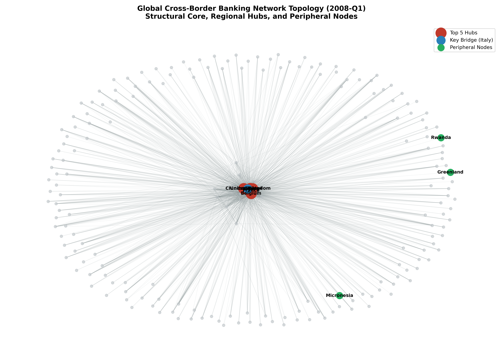

**Table A1 — Empirical Node Metrics (2008-Q1)**

| Country (Node) | Network Role | Out-Degree | In-Degree | Betweenness | Total Outward Claims (USD M) |
|---|---|--:|--:|--:|--:|
| **France** | Core Hub / Bridge | 186 | 21 | 0.0150 | $2,498,736 |
| **United Kingdom** | Core Hub / Bridge | 183 | 22 | 0.0170 | $2,089,045 |
| **Belgium** | Core Hub / Bridge | 162 | 19 | 0.0092 | $1,022,563 |
| **Spain** | Core Hub / Bridge | 154 | 21 | 0.0087 | $471,658 |
| **Chinese Taipei** | Regional Hub | 130 | 12 | 0.0042 | $165,207 |
| **Italy** | Bridge / Intermediary | 124 | 20 | 0.0050 | $749,874 |

*Peripheral nodes (Micronesia, Rwanda, Greenland) each hold a total degree of 1 and zero outward claims — passive sinks with no capacity to transmit contagion.*

### 2. Nonlinear & Asymmetric Risk

Global lending didn't decline gradually — it **peaked at $16.56 trillion** in 2008-Q1, then collapsed by over $3.5 trillion within a year: a textbook "hockey-stick" phase transition. The distribution of exposures is equally extreme: just **1% of lending connections held 34.32%** of total global exposure.

<p align="center">
  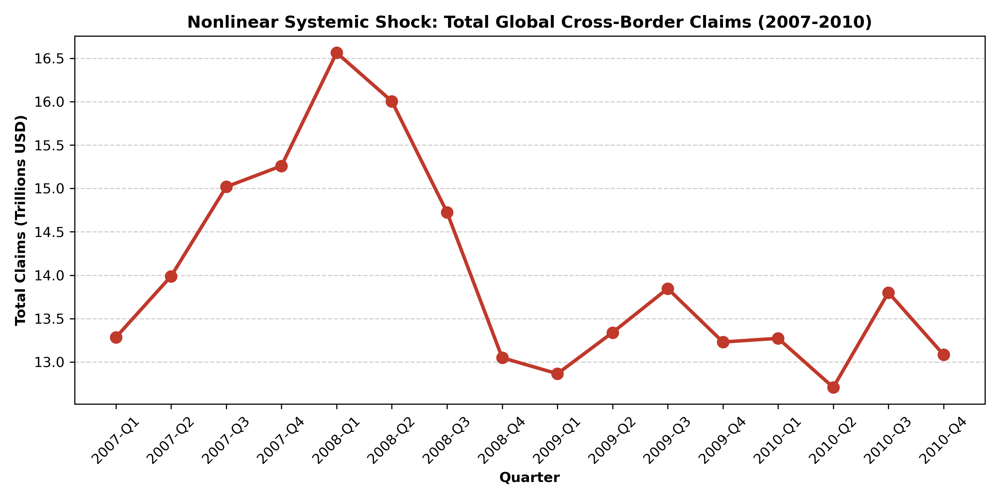
  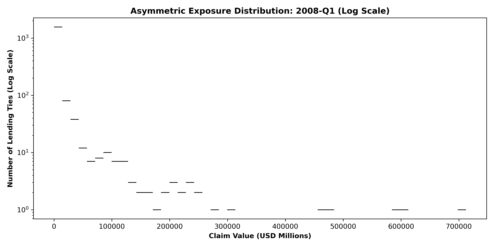
</p>

### 3. Strategic Coordination Failure — The Bank Run

The drop in cross-border lending was not purely mechanical — it was **strategic**. Facing uncertainty, major hubs fell into a Prisoner's Dilemma: each rationally withdrew funding from the United States to protect itself, and in doing so collectively starved the global periphery of liquidity.

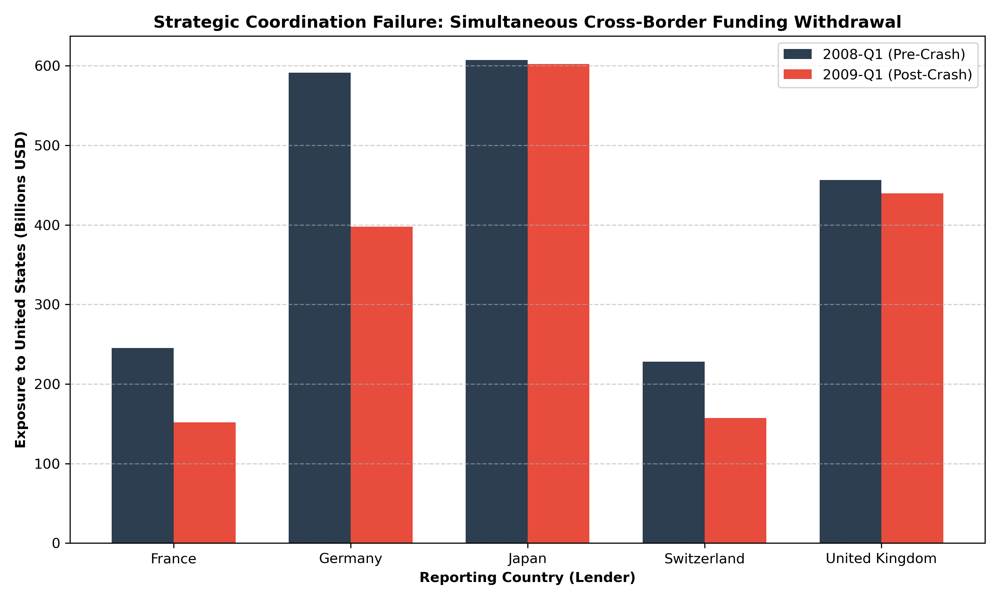

### 4. Integration — The Triple-Point Overlay

Intersecting all three lenses isolates the **United Kingdom** as the ultimate systemic bottleneck — simultaneously a structural hub, a link in the primary causal cascade (Germany → UK → US), and a strategic hoarding actor.

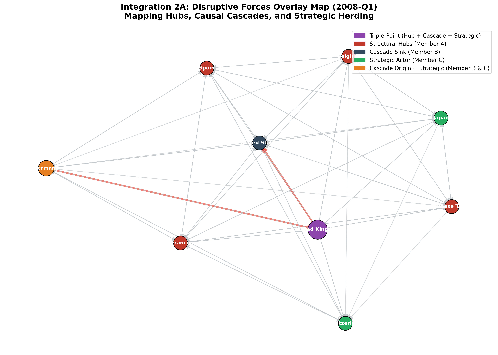

This is not a banking-specific quirk — the same hub/cascade/hoarding pattern reappears in global supply chains, such as the semiconductor shortage.

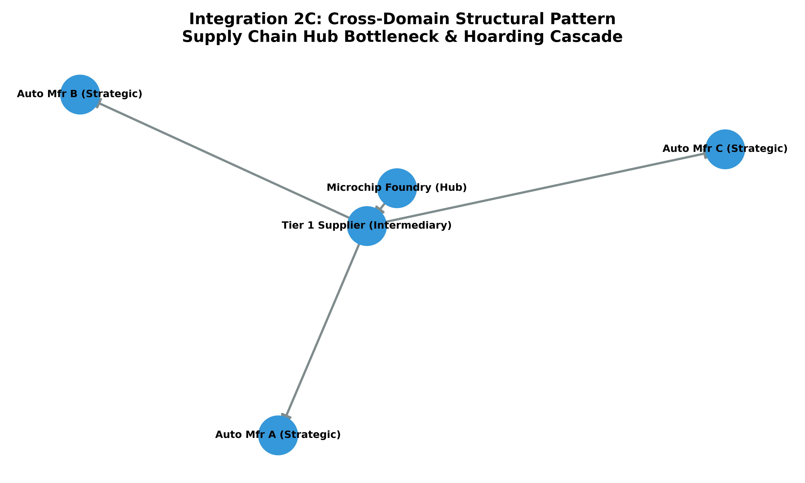

---

## 🖥️ Interactive Shiny Dashboard

Beyond the static notebooks, the project ships a **Shiny for Python** app (`app.py`) that lets you explore all three analytical lenses interactively — filter by quarter, adjust the number of hubs shown, pick a target country for the bank-run comparison, and download filtered data as CSV.

**Tab 1 — Network Cartography** (KPIs, top-lender bar chart, and an interactive Plotly exposure network):

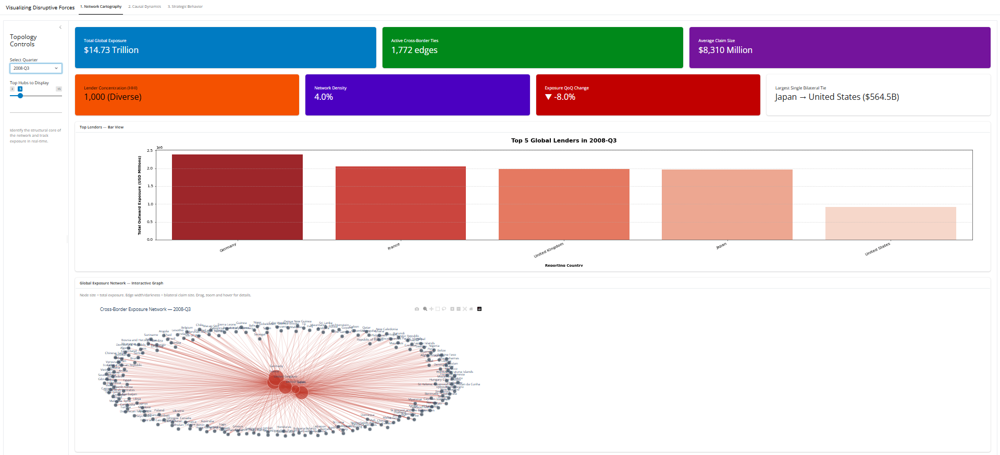

**Tabs 2 & 3 — Causal Dynamics and Strategic Behavior**, shown side by side:

<p align="center">
  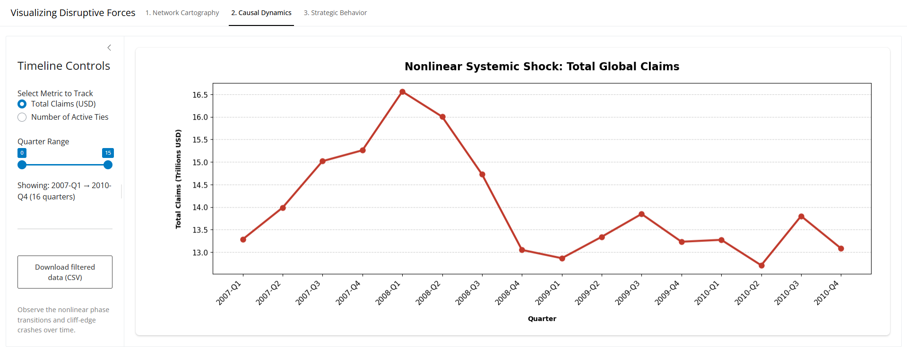
  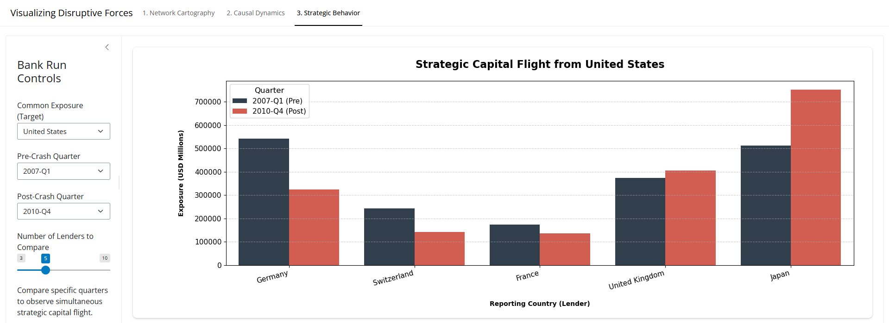
</p>

See [Running the Shiny App](#-running-the-shiny-app) below to launch it locally.

---

## 🏛️ Conclusion & Policy Recommendation

A holistic assessment reveals a sharp trade-off: structural "circuit breakers" (capital freezes) can themselves *trigger* the behavioral panic they're meant to prevent.

> **Recommendation:** Regulate banks based on their *position in the network*, not just their size. Institutions in "Triple-Point" jurisdictions should hold automated, mandatory liquidity reserves — **Asymmetric Capital Surcharges** — that scale with Betweenness Centrality, so they can absorb shocks without triggering a global withdrawal cascade.

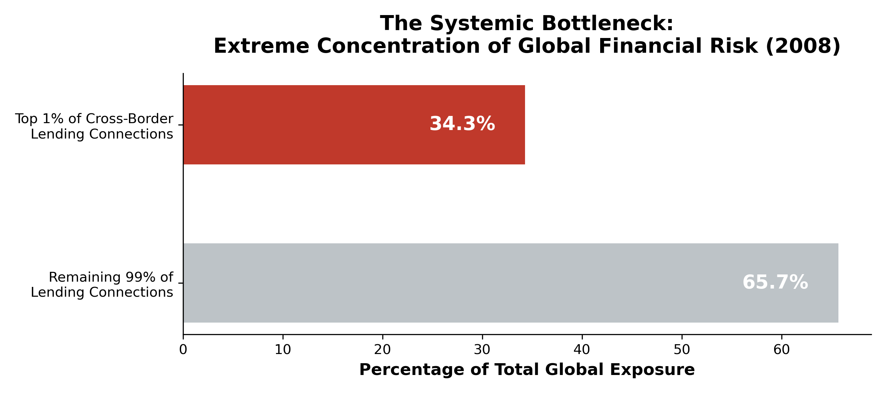

---

## 🔁 Reproducing the Analysis

```bash
git clone https://github.com/sanaurrehmanarain/visualizing-disruptive-forces.git
cd visualizing-disruptive-forces
pip install -r requirements.txt   # pandas, numpy, networkx, matplotlib, seaborn
jupyter notebook
```

Run the notebooks in order (`00` → `05`); each stage writes its outputs to `data/processed/`, `figures/`, and `tables/` for the next stage to consume.

---

## 🚀 Running the Shiny App

The interactive dashboard (`app.py`) is built with **[Shiny for Python](https://shiny.posit.co/py/)**, `shinywidgets` (for the embedded Plotly network graph), `pandas`, `networkx`, `matplotlib`/`seaborn`, and `plotly`.

**1. Install dependencies**

```bash
pip install shiny shinywidgets pandas numpy matplotlib seaborn networkx plotly
```

*(or simply `pip install -r requirements.txt` if you've already cloned the repo — see [Reproducing the Analysis](#-reproducing-the-analysis))*

**2. Make sure the processed data is in place**

The app looks for the network CSV at either of these paths (relative to wherever you launch it from):

```
data/processed/bis_cbs_network_2007_2010_positive_edges.csv
../data/processed/bis_cbs_network_2007_2010_positive_edges.csv
```

If this file doesn't exist yet, run notebook `00_data_preprocessing.ipynb` first — the app will still launch without it, but will show a data-warning banner and empty panels.

**3. Launch the app**

```bash
shiny run app.py
```

By default this serves the dashboard at **http://127.0.0.1:8000**. Useful flags:

```bash
shiny run app.py --reload          # auto-reload on code changes (dev mode)
shiny run app.py --host 0.0.0.0 --port 8080   # expose on a custom host/port
```

Then open the printed URL in your browser. You'll land on **1. Network Cartography**, with **2. Causal Dynamics** and **3. Strategic Behavior** available as additional tabs at the top.

---

## 📖 Citation

If you use this project in academic research, publications, educational materials, or derivative works, please cite it and credit the original author. A [`CITATION.cff`](CITATION.cff) file is included, so GitHub also provides a **"Cite this repository"** button in the sidebar (BibTeX, APA, and other formats).

**Suggested citation:**

> Arain, S. U. R. (2026). *Visualizing Disruptive Forces in the Global Banking Network: A Multi-Lens Analysis of the 2008 Financial Crisis* (Version 1.0) [Software]. https://github.com/sanaurrehmanarain/visualizing-disruptive-forces

| | |
|---|---|
| **Author** | Sana Ur Rehman Arain |
| **Role** | Data Scientist |
| **GitHub** | [@sanaurrehmanarain](https://github.com/sanaurrehmanarain) |
| **Contact** | sana.arain.work@gmail.com |

---

## 📜 License

This project is licensed under the **MIT License** — see [LICENSE](LICENSE) for details. The license requires that the original copyright notice be retained in copies of the software.

---

<p align="center">
⭐ If this project was useful to you, consider starring the repo — it helps others discover it and supports future work.
</p>